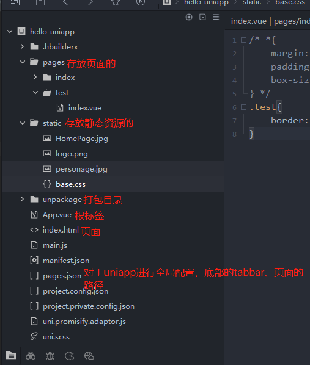
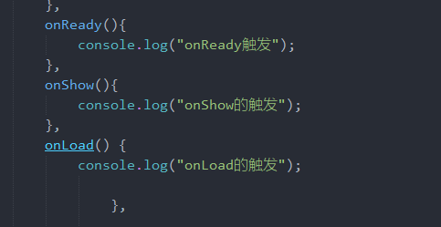
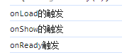
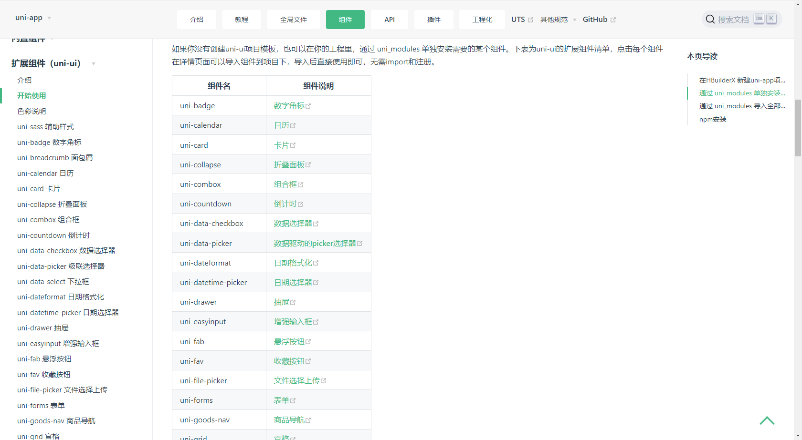
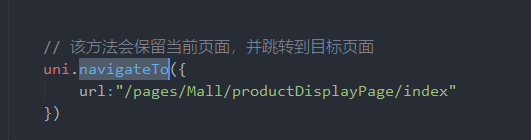
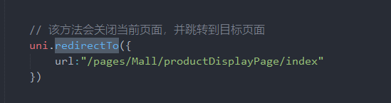
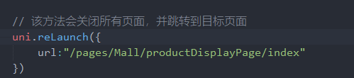
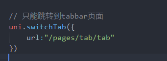
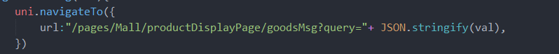

# 学习uniapp
    
 <!-- #### 一、环境搭建
    
 ## 1.1 下载编辑器 HBuilderX
 下载的软件的链接：
 https://www.dcloud.io/hbuilderx.html
 ###### 1.2 下载微信小程序开发工具
 下载的链接：https://developers.weixin.qq.com/miniprogram/dev/devtools/download.html

  ###### 1.3 创建uniapp项目后自动生成了目录结构 
  简单描述一下目录结构
  </img>

 ###### 1.4 浏览器运行
  在HB 里的操作栏中找到运行右击出现==》 【运行到浏览器】 -->

  ## 一、uniapp的生命周期
  分为：应用生命周期、页面生命周期、组件生命周期、
  ###### 1.1 应用生命周期：仅在app.vue页面有效 （简单列举出常用的）
     onLaunch：初始化页面
     onShow：显示页面时触发
     onHide：隐藏页面是触发、前台切换到后台时触发
 ###### 1.2 页面生命周期：
     onInit：监听页面初始化时触发
     onLoad：页面元素加载完成后触发
     onShow：显示页面时触发
     onReady：页面初次渲染完成，在dom解析完成之后立刻被调用，发生在内容之前
     onHide：隐藏页面是触发、前台切换到后台时触发
 <font color="red">onLoad 、 onReady和onShow  的区别在于: </font>
 
在小程序中，加载一个新的页面时，先是执行**onLoad**再执行**onShow**后执行**onReady**。<br>
<div style="display:flex;align-items: center;">


</div>

在执行<font color="red" >onLoad</font>函数时，页面还没有被渲染，无法进行dom操作，而且获取参数并且只请求一次的事件可以放在onLoad里，
在 <font color="red" >onReady</font> 函数执行时，页面已经被渲染出来了，就可以进行dom操作了。
而<font color="red" > onShow</font>函数是每次显示页面时都会执行


 ###### 1.3 组件生命周期：
      组件生命周期和vue的是一样的

 ## 二、目录--配置
     
###### 2.1 page.json文件
      比如：页面的路径===pages、原生的导航栏===globalStyle、底部的原生的tabbar===tabBar等...
       1.1 pages：在新建一个页面文件时默认勾选在page.json中注册，就会自动生成该对应的路径
       1.2 globalStyle：全局的样式配置、例如导航栏背景色、导航栏标题
       1.3 tabbar:底部切换的tab，
###### 2.2 static文件夹
       static文件夹相当于public ，存放静态资源，例如：图片、css
###### 2.3 pages文件夹
       pages文件夹相当于src，里面可以存放页面、js文件、共同组件...
###### 2.4 main文件
       main文件是入口
       
    
## 三、uniapp自带的组件库  uni-ui
   比如说：vue的伴生是elementui组件库，那么uniapp的伴生就是uni-ui。它是基于vue组件、flex布局的、
无dom的跨全端ui框架。

  在创建文件夹时选择uni-ui项目，创建完成之后就可以直接使用组件库了，在页面输入"u"就出现u开头
的标签，选择其中一个就可以使用该组件。

可通过：<https://uniapp.dcloud.net.cn/component/uniui/quickstart.html> 查看uniapp官网


##  四、页面样式和布局
###### 4.1 尺寸单位
uniapp支持的通用css单位包括：px和rpx <br/>
px：固定的像素长度单位<br/>
rpx：小程序中专用的长度单位，可以根据屏幕宽度自行适应<br/>
###### 4.2 引入样式和选择器
页面引入外部样式还是使用@import语句。<br/>
选择器注意：在uniapp中不可使用 <font color="red"> *</font>  选择器
###### 4.3 全局样式与局部样式
在app.vue中的样式为全局样式，适用于每一个页面
在单页面里面写的样式为局部样式，只作用于对应的页面中，并会覆盖掉app.vue中相同的选择器

## 五、路由 router跳转方式
 在uniapp中，可以通过以下方式进行页面跳转：
###### 5.1  使用navigateTo
使用uni.navigateTo（）方法跳转页面，该方法会保留当前页面，并跳转到目标页面


###### 5.2  使用redirectTo
使用uni.redirectTo（）方法跳转页面，该方法不会保留当前页面 关闭页面，并跳转到目标页面


##### 5.3  使用reLaunch
使用uni.reLaunch（）方法跳转页面，该方法会关闭所有的页面，并跳转到目标页面


##### 5.3  使用switchTab
使用uni.switchTab（）方法跳转页面，该方法只能使用在tabbar中


##### 5.4 使用标签navigator跳转  uniapp的内置组件的路由与页面跳转
是以标签的形式来跳转的，该组件类似标签  <font style="color:red">a</font> 组件，但只能跳转本地页面，目标页面必须在page.json中注册


##  六、传参
###### 6.1  路由传参
 路由url传参：可以通过路由拼接的方式传递参数，在跳转的页面里接收<br>
 

###### 6.2 父传子
 父传子：跟vue一致，通过在父组件中的子组件上绑定参数，子组件使用props接收即可<br>
  ```
   <!-- 父组件传递 -->
   <template>
	<view>
		<serch  :placeholder="InputData" ></serch>
	</view>
</template>
<script>
export default {
		//注册组件
		components: { serch, },// 搜索
		data() {return {
                     InputData：'数据'
              }},
}
</script>
<!-- 子组件接收 -->
<template>
	<view class="serch-style" >
		<input ref="serach" 
		:placeholder="DataNamePlaceholder"
		:focus="true"/>		
	</view>
</template>

<script>
	export default {
<!-- 使用props -->
		props:["placeholder"],
		data() {
			return {
				DataNamePlaceholder:""
			}
		},
		mounted() {
        // 接受父组件传递的参数 
			this.DataNamePlaceholder=this.$options.propsData.placeholder
				},
  ```


 ###### 6.3 子传父
  子传父：跟vue一致，子组件通过$emit发送自定义事件，在父组件的子组件上接受自定义事件<br>
  ```
  <!-- 子组件中自定义事件，参数 -->
   this.$emit("search",this.DataName)
   <!-- 父组件接受 -->
   <template>
	<view>
		<serch @search="searchDataAll" :placeholder="InputData" ></serch>
	</view>
</template>
<script>
export default {
		//注册组件
		components: { serch, },// 搜索
		data() {return {}},
		methods: {
			// 搜索得到数据
		async searchDataAll(val){
			console.log(val,"传递的值");
			},
                     }
}
</script>
  ```
 ###### 6.4 组件之间
 组件之间：可以使用uni自带的<font style="color:red">uni.$emit</font>  和<font style="color:red">uni.$on</font><br>
  uni.$emit触发全局的自定义事件。附加参数都会传给监听器回调。<br>
  uni.$on监听全局的自定义事件。回调函数接收所传入的参数
  ```
  <!-- A页面传递参数   -->
       uni.$emit('AddData',{mes:"2"})
---------------------------------------------------------------------------
  <!-- B页面接收参数 -->
  onLoad() { 
	// 使用$on接收
	uni.$on('AddData',this.AddData)
},
methods: {
	AddData(e){
	   console.log(e,"接收值")
	},
}
  ```   

这样写会在第一遍跳转的时候，接收不到值，需要再返回A页面点击跳转B页面，B页面才能接收到值，这是因为第一次时uni.$on
还没有定义完成，因此没有接收到$emit传递的数据。
可以在A页面的$emit上绑定一个定时器（我目前使用较为简单方法，之后如有更好的，再重新编辑文档）
```
setTimeout(()=>{
	uni.$emit('serchData',res)
},500)
```
因为uni.$emit和uni.$on触发的都是全局跨页面传参，所以需要及时的销毁事件监听，这时候就要使用了<font style="color:red">uni.$off</font>，
比如页面onload里面uni.$on注册了监听，onUnload里面就使用uni.$off销毁监听。
```
<!-- 可以通过返回值来判断是否成功移除了事件监听器 -->
onUnload(){
	 let res=uni.$off("serchData")
	 console.log(res ?"销毁了" : "并没有");
		},
```
官网上给出了uni.$off的使用方式：<br>
* 如果没有给参数，是移除了所有监听事件。<br>
* 如果只提供事件，是移除了该事件下的所有监听事件。<br>
* 如果同时提供了事件和回调，是移除了回调里的监听器。<br>
* 提供的回调必须要跟uni.$on里的回调为同一个才能移除整个回调的监听器<br>

当然，如果是一次性的事件就可以直接使用uni.$once里使用


